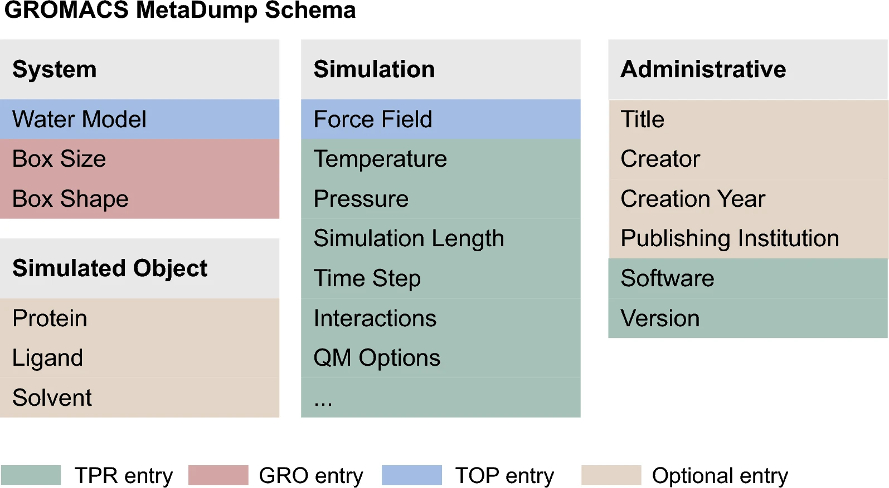

# GROMACS MetaDump Repository

In this repository we present the source code of GROMACS MetaDump - a software tool for the automatic extraction of metadata from molecular dynamics (MD) simulations performed with GROMACS. GROMACS MetaDump captures all extractable simulation parameters, such as software version, force field, water model, box geometry, temperature, etc., and returns them in a structured JSON or YAML file. As a result, GROMACS MetaDump supports the creation of unified metadata annotations of MD simulations, making datasets indexable and findable in line with the FAIR principles.

## Cite
If you found this tool helpfull, please cite:

Rošinec, A., Slanináková, T., Pavlík, T. et al. Gromacs MetaDump: a tool for extracting GROMACS simulation metadata. J Cheminform 17, 160 (2025). https://doi.org/10.1186/s13321-025-01082-5

## Overview of metadata schema

## Tool availability

### Web
Available at https://gmd.ceitec.cz, where it is possible to obtain metadata after uploading a TPR file without need to install or run local scripts.

### CLI
See the `cli` folder of this repository.

### Calling API
See the [manual](https://github.com/sb-ncbr/gromacs-metadump/wiki/manual).

## Authors
- Adrián Rošinec - adrian@ics.muni.cz
- Ondřej Schindler - ondrej.schindler@mail.muni.cz

## License
BSD 3-Clause License, see LICENSE file

Copyright (c) 2025, Masaryk University.
All rights reserved.
